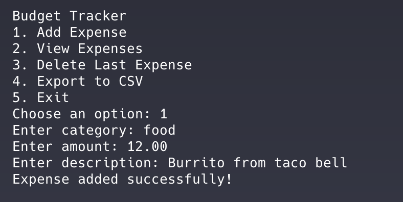

# Budget Tracker

## A simple command-line app to track your personal expenses

**Run the program:**

1. Clone the repository to a local folder  
2. Navigate to the project folder  
3. Run `python3 app.py` in the terminal

---

## Features

- Stores expense data in a `budget_data.json` file located in the same directory as the script
- Exports all recorded expenses to a `budget_export.csv` file
- Deletes the most recent expense
- Simple menu-driven interface for adding, viewing, exporting, and deleting expenses

---

## How it works

When you run the program, you'll be presented with a menu of options:

1. **Add Expense**  
2. **View Expenses**  
3. **Delete Last Expense**  
4. **Export to CSV**  
5. **Exit**

---

### 1. Add Expense

- **Category**: e.g., "Groceries", "Rent", "Gas"
- **Amount**: Enter the expense amount (e.g., 45.99)
- **Description**: A brief description to help identify the expense

---

### 2. View Expenses

This option displays all expenses currently saved in the `budget_data.json` file.

---

### 3. Delete Last Expense

Removes the most recently added expense entry and updates the JSON file.

---

### 4. Export to CSV

Saves all expenses to a file called `budget_export.csv` in the same directory as the script. Useful for opening your data in Excel or Google Sheets.

---

### 5. Exit

Gracefully exits the program with a goodbye message.

---

## File Structure

